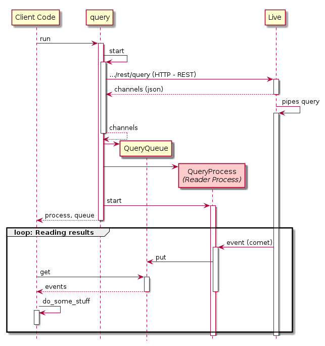

# The `query` module

Queries are one of the most useful services the Live platform offers.

Queries are sent to Live via HTTP requests which cause Live to start the query and return the addres of a comet web socket to push the results.

The query module provides the tools to issue and read read results from queries in a python project.

# Running Live Queries

Live querie can be realtime or non realtime. Non realtime queries run once collect their results, return them to the caller and terminate.
Realtime querie however stay alive for an extended period of time retrieving new events as they occur and only terminate if asked to do so.

The `live_client.query` module uses python multiprocessing to enable results retrieving even if they are realtime. The following diagram summarizes the mechanism.



`query.run` spawns a process that reads data from Live. The results read by this process can be obtained by getting values from its associated queue. Clients of the `query` module must implement a loop to read the received events or the appropriate non blocking code to handle them.

For instance, to print the query output to the console one can write:

``` python
from live_client import query

query_str = "<my pipes query>"
process, queue = query.run(query_str, settings, realtime=True)
while True:
    event = queue.get()
    event_type = event.get("data", {}).get("type")
    if event_type == query.EVENT_TYPE_DESTROY:
        break
    elif event_type != query.EVENT_TYPE_EVENT:
        continue

    print(event)
```

As a convenience the `query` module offers the decorator `on_event` which turns the decorated function into the above mentioned message loop. The last example can be rewritten with `on_event` like this:

``` python
from live_client import query

query_str = "<my pipes query>"
@query.on_event(query_str, settings)
def monitor(event):
    print(event)

monitor()
```
